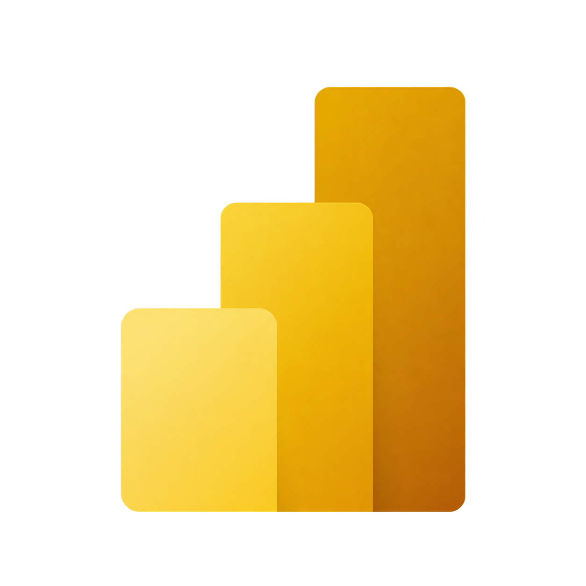
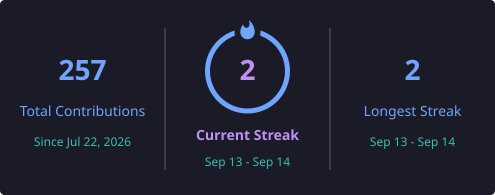

 

  

 
  
  &nbsp;&nbsp;&nbsp;&nbsp;&nbsp;&nbsp; 
  &nbsp;&nbsp;&nbsp;&nbsp;&nbsp;&nbsp; 
  &nbsp;&nbsp;&nbsp;&nbsp;&nbsp;&nbsp;
  &nbsp;&nbsp;&nbsp;&nbsp;&nbsp;&nbsp;
  

 

<h2 align="left">👨‍💻 About Me</h2>

🎓 Final-year <strong>BSc Data Science student at the University of Mumbai</strong> with a <strong>9.5 CGPA</strong>.

📊 Passionate about <strong>Data Analytics, Business Intelligence, Machine Learning, and Data Visualization</strong>.

💻 Skilled in <strong>Python, SQL, Power BI, Excel, Pandas, NumPy, and Scikit-learn</strong>.

🏢 Currently working as a <strong>CRM Coordinator & Data Expert at TellMe</strong>, an IIM Mumbai incubated startup.

🔎 I enjoy discovering patterns in data, building analytical solutions, and turning data into actionable business insights.

🎯 Currently seeking opportunities in <strong>Data Analytics, Business Analysis, Data Science, and Business Intelligence</strong>.

<h2 align="left">🛠️ Tech Stack</h2>

<h4 align="left">📊 Data Analysis & Visualization</h4>

&nbsp;

&nbsp;

<h4 align="left">🤖 Data Science & Machine Learning</h4>

&nbsp;

&nbsp;

&nbsp;

<h4 align="left">🗄️ Databases</h4>

&nbsp;

&nbsp;

&nbsp;

<h4 align="left">📈 Business Intelligence & CRM</h4>

&nbsp;

&nbsp;

&nbsp;

<h4 align="left">💻 Tools & Development</h4>

&nbsp;

&nbsp;

&nbsp;

&nbsp;

<h2 align="left">🚀 Featured Projects</h2>

<h4>😊 Customer Satisfaction Prediction</h4>

<strong>Python • Pandas • NumPy • Scikit-learn</strong>

Built classification models with feature engineering and evaluated model performance using accuracy and precision to derive business insights.

🔗 <strong><a href="https://github.com/Aaron-Mendonca/Customer-Satisfaction-Prediction">View Project</a></strong>

 

<h4>🎬 Netflix Data Analysis</h4>

<strong>Python • Pandas • Matplotlib • Seaborn</strong>

Conducted exploratory data analysis and created visualizations to uncover content trends and user preferences.

🔗 <strong><a href="https://github.com/Aaron-Mendonca/Netflix-Data-Analysis-">View Project</a></strong>

 

<h4>🌫️ Air Quality Prediction</h4>

<strong>Python • Pandas • NumPy • Scikit-learn</strong>

Built regression models using preprocessing and feature selection techniques for AQI prediction.

🔗 <strong><a href="https://github.com/Aaron-Mendonca/Air_Quality_Prediction">View Project</a></strong>

<h2 align="left">📊 GitHub Analytics</h2>

  
  

  

<h2 align="left">🐍 GitHub Contribution Snake</h2>

  <picture>
    <source
      media="(prefers-color-scheme: dark)"
      srcset="https://raw.githubusercontent.com/Aaron-Mendonca/Aaron-Mendonca/output/github-contribution-grid-snake-dark.svg"
    />
    <source
      media="(prefers-color-scheme: light)"
      srcset="https://raw.githubusercontent.com/Aaron-Mendonca/Aaron-Mendonca/output/github-contribution-grid-snake.svg"
    />
    
  </picture>

<h2 align="left">🌱 Currently Learning</h2>

  

📊 Advanced Data Analytics  
🗄️ Advanced SQL  
🤖 Machine Learning  
📈 Business Intelligence  
📉 Statistical Analysis  
💡 Predictive Modelling

<h2 align="left">🤝 Let's Connect</h2>

  
Let’s Connect • Share Ideas • Turn Ideas Into Insights • Explore Data • Build Something Meaningful • Create Insights • Grow Together 🚀

 &nbsp;&nbsp;&nbsp;&nbsp;&nbsp;&nbsp; 
  &nbsp;&nbsp;&nbsp;&nbsp;&nbsp;&nbsp; 
  &nbsp;&nbsp;&nbsp;&nbsp;&nbsp;&nbsp;
  &nbsp;&nbsp;&nbsp;&nbsp;&nbsp;&nbsp;
  

 

  

<strong>📊 DATA IS THE NEW OIL , BUT INSIGHTS ARE THE REAL FUEL 🚀</strong>

